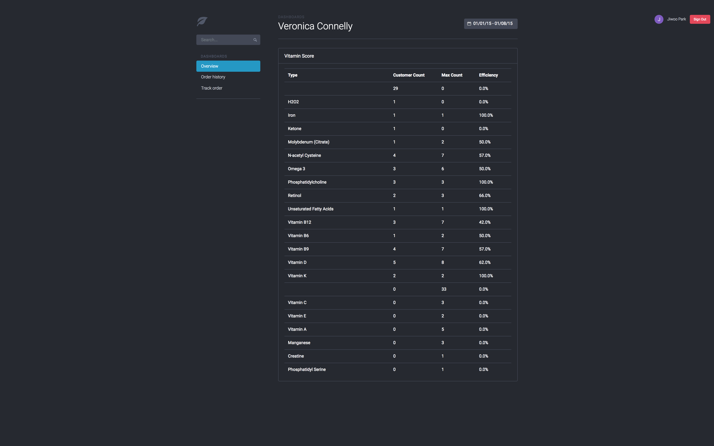
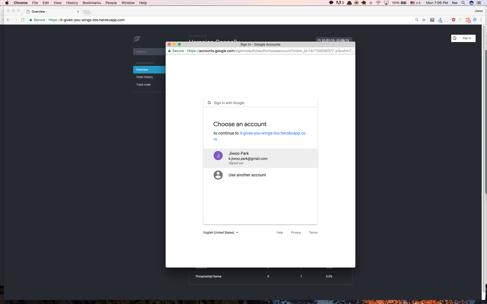
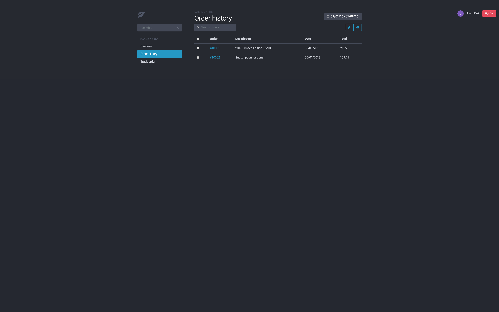
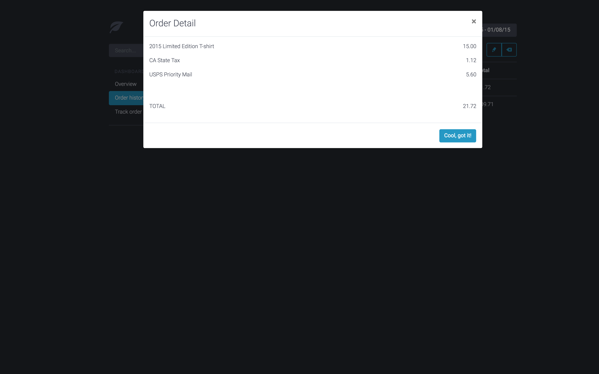
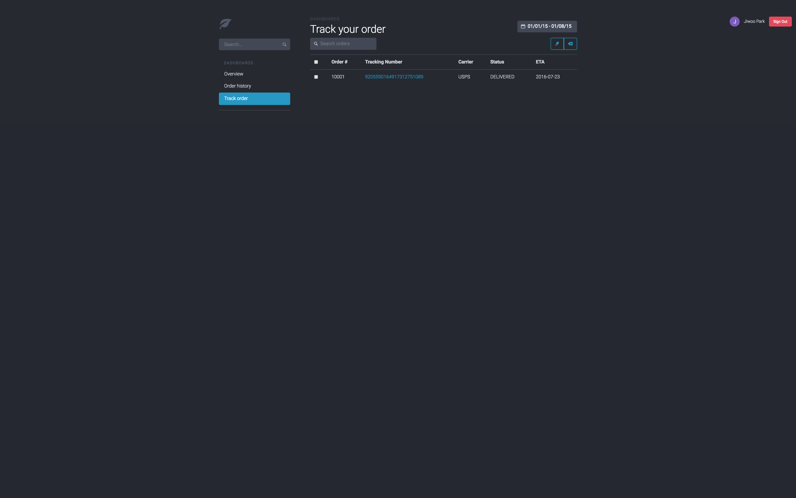
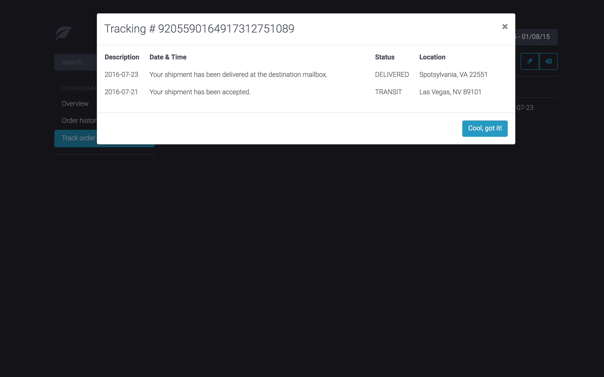

# It Gives You Wings Too

### Features 

- Google account athenticated access ensuring security and privacy.
- Visualized report of periodic vitamin scores
- History of previous orders
- Tracking Information

#### User Interface

| Overview |
| ---------- |
|  | 

| OAuth (Google) |
| ---------- |
|  | 

| Order History |
| ---------- |
|  | 

| Order History Detail (Modal View) |
| ---------- |
|  | 

| Tracking Information |
| ---------- |
|  | 

| Tracking Information (Modal View)|
| ---------- |
|  | 

#### Routes (Endpoints)

- `/` Index(Overview)
- `/order-history` Order History
- `/track-order` Tracking Information

### Future Additions

- Integrating OAuth with existing Users DB

- More graphical UI for better understanding of information

